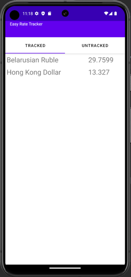

# EasyRateTracker2

My android jetpack app sample

## App idea

It allow track some rates from outer APIs (now it's only one realized, be appreciate if somebody advise free rate API)

## Why?

I made this sample for learn, for improve my code and I'll be glad to see if it helps somebody. I appreciate every bug you find or just a code tip.

## Why is it named 2?

The first version of the project was in Java and outdated, so I didn't open it.

## Contacts
Send me your suggestions to maxkikin@yandex.ru

